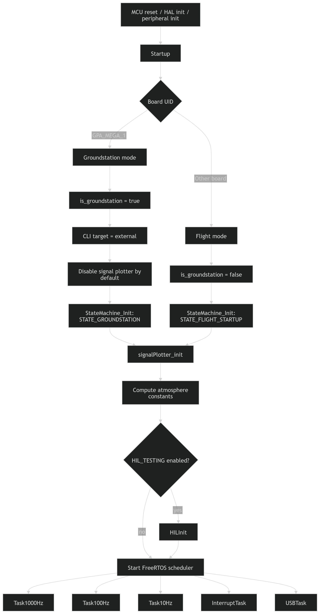
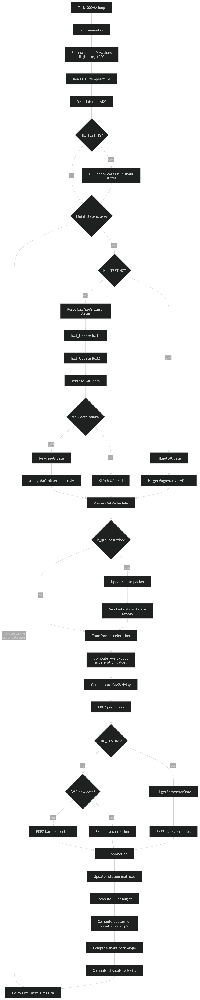
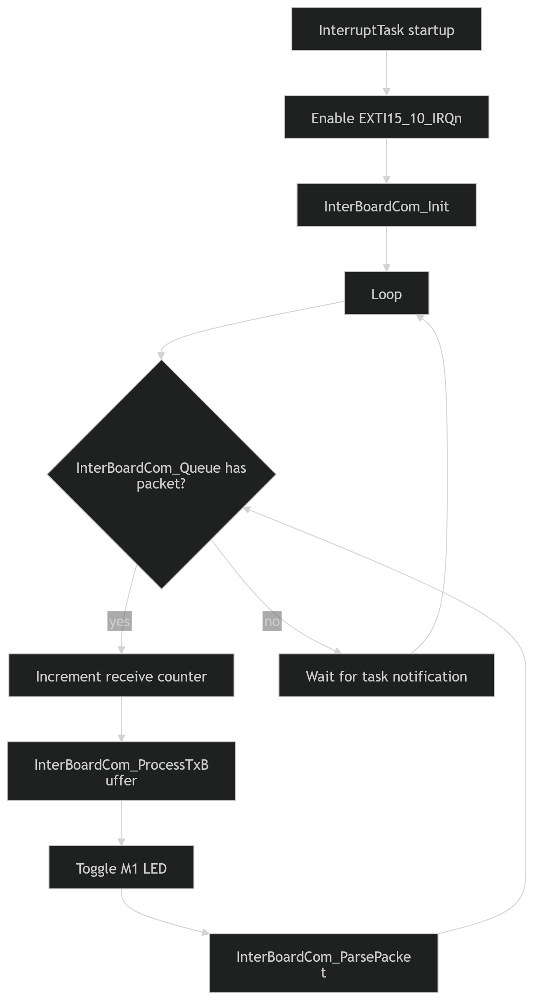
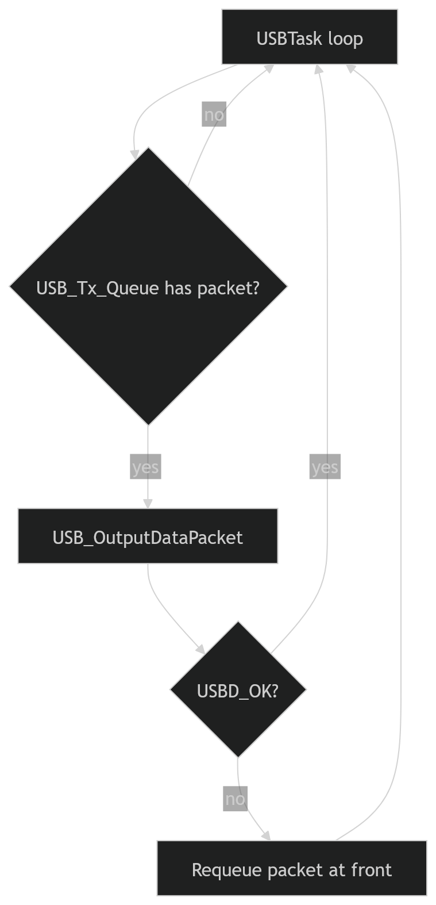
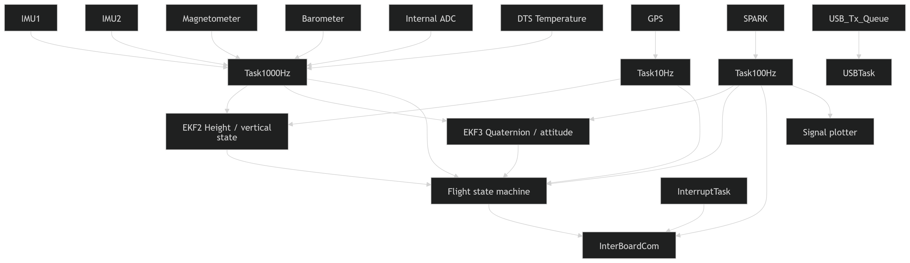

# Main Application Task Architecture

## Purpose
This file contains the high-level runtime structure of the firmware.

It defines:

- Startup initialization before the FreeRTOS scheduler starts
- Main periodic control/navigation tasks
- Inter-board communication handling
- USB transmission handling
- Groundstation vs flight-board startup behavior

The system is organized around FreeRTOS tasks running at different rates:

Task1000Hz      high-rate sensing, prediction, state machine actions
Task100Hz       medium-rate corrections, SPARK/ACS, telemetry/status
Task10Hz        GPS and low-rate correction
InterruptTask   inter-board packet handling
USBTask         queued USB packet output

| Task            |               Rate |           Period | Main responsibility                                                                      |
| --------------- | -----------------: | ---------------: | ---------------------------------------------------------------------------------------- |
| `Task1000Hz`    |            1000 Hz |             1 ms | High-rate state machine actions, IMU/mag/baro/ADC updates, EKF prediction                |
| `Task100Hz`     |             100 Hz |            10 ms | Medium-rate state machine actions, SPARK/ACS, EKF attitude corrections, telemetry/status |
| `Task10Hz`      |              10 Hz |           100 ms | GPS readout and GNSS correction                                                          |
| `InterruptTask` |       Event-driven | ISR notification | Inter-board SPI/packet processing                                                        |
| `USBTask`       | Continuous polling |     none visible | Sends queued USB packets, retries failed packets                                         |

# 1000Hz Task

- 1000 Hz state machine actions
- internal temperature readout
- internal ADC readout
- high-rate IMU and magnetometer acquisition
- data scheduler processing
- acceleration transformations
- GNSS delay compensation
- height EKF prediction and barometer correction
- quaternion EKF prediction
- rotation matrix / Euler / flight path calculations

# 100Hz Task

- 100 Hz state machine actions
- data scheduler initialization
- SPARK data readout
- ACS angle estimation
- quaternion EKF magnetometer correction
- quaternion EKF accelerometer correction
- inter-board TX buffer processing
- signal plotter output
- status display

Notes

The commented pitot/ptot_readData() section says it must not be active at the same time as SPARK communication because both use the same SPI bus.

That is important documentation and should be moved into a formal SPI ownership note.

# 10Hz Task

- 10 Hz state machine actions
- GPS initialization
- GPS readout
- GNSS height/velocity correction for height EKF

# Interrupt Task

Highest-priority event-driven task for interrupt-originated communication events.

Important note

InterruptTask blocks on: ulTaskNotifyTake(pdTRUE, portMAX_DELAY);
but only after it has drained all currently available packets from InterBoardCom_Queue.

That means it handles bursts of queued inter-board packets before sleeping again.

# USB Task

Lowest-priority task for USB output.
It consumes DataPacket_t packets from USB_Tx_Queue.

# Main Data Flow

